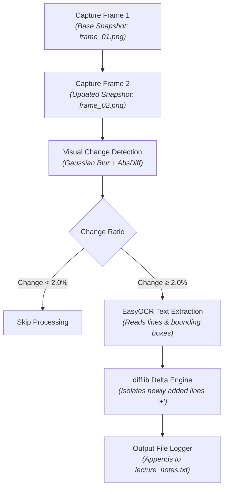

# AirNote AI - Phase 1 Implementation Guide

An automated computer vision and OCR pipeline for lecture blackboard tracking, visual change detection, delta extraction, and text logging.

---

## Technical Architecture & Workflow

---

## Environment Setup & Requirements

### System Requirements
* **Python Version**: Python `3.9` to `3.11`
* **Operating System**: Windows / Linux / macOS
* **Dependencies**: OpenCV, EasyOCR, Matplotlib, Pillow, NumPy

### Installation Commands

```bash
# Create virtual environment
python -m venv airnote_env

# Activate environment (Windows)
airnote_env\Scripts\activate

# Activate environment (macOS/Linux)
source airnote_env/bin/activate

# Install core libraries
pip install easyocr opencv-python matplotlib pillow numpy notebook
